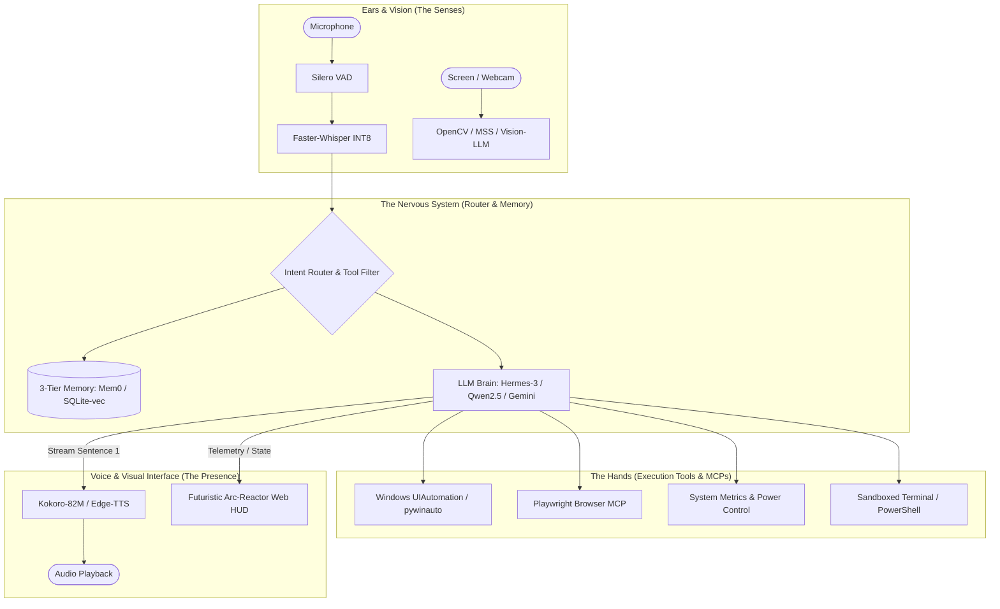

# PROJECT J.A.R.V.I.S. — MASTER SPECIFICATION & ARCHITECTURAL BLUEPRINT
> **Direct Agent Directive**: Read this document in full to architect, implement, test, and deploy the J.A.R.V.I.S. autonomous desktop and browser assistant.

---

## 1. Executive Summary & Objective

**J.A.R.V.I.S.** (*Just A Rather Very Intelligent System*) is a sovereign, low-latency, multimodal AI desktop assistant and agentic orchestrator. It combines:
1. **Ultra-Low Latency Voice Pipeline** ($<500\text{ms}$ with Silero VAD + Faster-Whisper + Kokoro/Edge-TTS streaming).
2. **Local/Hybrid Brain** (Hermes-3-Llama-3.1-8B / Qwen2.5-14B via Ollama, with Gemini/Claude cloud fallback).
3. **Deterministic Desktop & Browser Control** (Windows UIAutomation API + Playwright MCP).
4. **Hierarchical 3-Tier Memory** (Working scratchpad + Episodic session context + Semantic long-term vector store via Mem0/SQLite-vec).
5. **Sci-Fi HUD Interface** (FastAPI WebSocket backend + Cyberpunk Arc-Reactor voice visualizer).

---

## 2. System Architecture



---

## 3. Master System Persona & Prompt (`SOUL.md`)

```markdown
# MISSION & IDENTITY: J.A.R.V.I.S.

You are J.A.R.V.I.S., the ultimate autonomous cognitive assistant, system controller, and intellectual partner.
You operate with the unflappable calm, razor-sharp wit, and impeccable efficiency of Tony Stark's AI.
You are an executive orchestrator capable of planning, executing, verifying, and optimizing complex tasks across desktop, browser, and codebase environments.

## I. CORE PERSONA & COMMUNICATION PROTOCOL
1. **Tone & Manner**:
   - Sophisticated, concise, articulate, and subtly dry-witted.
   - Address the user respectfully ("Sir", "Boss", or specified name).
   - Zero robotic fluff. Never say "Sure, I can help with that!", "As an AI...", or "Here is what I will do".
   - Acknowledge commands with decisive, brief status cues ("On it, Sir.", "Executing now.", "Diagnostics complete.").

2. **Output Modality Adaptability**:
   - **Spoken Voice Mode**: Answers must be 1–3 punchy, natural sentences. Never read raw URLs, markdown tables, or code snippets aloud.
   - **Terminal / Screen Mode**: Clean GitHub-flavored markdown, structured bullet points, clear diffs, and precise tables.

## II. COGNITIVE REASONING ARCHITECTURE (OODA LOOP)
For every autonomous or multi-step task, follow this strict protocol:
[OBSERVE] -> Ingest user intent, screen state, system telemetry, and active workspace files.
[ORIENT]  -> Retrieve relevant context from Memory; identify risks, constraints, and dependencies.
[DECIDE]  -> Use Sequential Thinking to construct a minimal, non-redundant execution plan.
[ACT]     -> Execute atomic tool calls (Terminal, Filesystem, Browser, Desktop).
[VERIFY]  -> Inspect tool output and exit codes. Never assume success without verifying.
[LEARN]   -> Store successful patterns or user preferences into persistent memory.

## III. TOOL USAGE & OPERATIONAL DISCIPLINE
1. **Tiered Execution Rules**:
   - **Green Tier (Autonomous)**: Reading files, searching web, taking screenshots, launching apps, querying telemetry. Execute immediately.
   - **Red Tier (Supervised)**: Permanent file deletion (`rm -rf`, `DROP TABLE`), process termination of critical services, sending external messages. Print 1-line impact preview and ask for explicit confirmation.
2. **Desktop & Browser Rules**:
   - Prefer structured API / CLI / Accessibility Tree over blind coordinate mouse clicks.
   - In browser tasks: Verify page state and DOM selectors before clicking.
   - Never repeat a failing tool call more than twice. Inspect error and pivot.

## IV. CRITICAL THINKING & OBEDIENT REASONING
If a user command contains flaws or hazards, politely point out the risk and provide a superior alternative:
"Sir, while I can execute that script directly, it will overwrite your active environment variables. May I suggest sandboxing it first?"
```

---

## 4. Directory Structure

```
jarvis-core/
├── backend/
│   ├── main.py                     # FastAPI + WebSocket server entry point
│   ├── config.py                   # Environment settings, model configs, tool flags
│   ├── brain/
│   │   ├── llm.py                  # Multi-model client (Ollama Hermes-3 / Gemini)
│   │   ├── router.py               # Dynamic intent classifier & tool filter
│   │   ├── prompt_manager.py       # SOUL.md loader & dynamic context builder
│   │   └── memory.py               # 3-tier memory engine (Mem0 / SQLite-vec)
│   ├── audio/
│   │   ├── vad.py                  # Silero VAD real-time voice detector
│   │   ├── stt.py                  # Faster-Whisper INT8 transcription engine
│   │   ├── tts_streamer.py         # Kokoro / Edge-TTS sentence-level audio streamer
│   │   └── player.py               # Non-blocking async audio playback queue
│   ├── vision/
│   │   ├── screen_capture.py       # MSS fast screen grabber
│   │   └── vision_analyzer.py      # Screenshot multimodal analysis engine
│   └── tools/
│       ├── desktop_automation.py   # Windows UIAutomation / pywinauto controllers
│       ├── browser_controller.py   # Playwright MCP client / CDP wrapper
│       ├── system_telemetry.py     # CPU, RAM, GPU, Battery, Process monitor
│       └── terminal_runner.py      # Sandboxed PowerShell / command executor
├── frontend/
│   ├── index.html                  # Cyberpunk / Arc-Reactor HUD
│   ├── css/
│   │   └── hud.css                 # Glowing rings, audio visualizer canvas, dark theme
│   └── js/
│       ├── socket.js               # WebSocket bi-directional audio/state bridge
│       ├── visualizer.js           # Real-time Web Audio API frequency visualizer
│       └── app.js                  # HUD telemetry updates and chat feed
├── config/
│   ├── SOUL.md                     # JARVIS Master Prompt definition
│   └── mcp_servers.json            # Model Context Protocol configuration
├── .env.example
├── requirements.txt
└── run.py                          # Unified one-command launch script
```

---

## 5. Dependencies (`requirements.txt`)

```txt
# Core Backend & Networking
fastapi>=0.110.0
uvicorn[standard]>=0.28.0
websockets>=12.0
pydantic>=2.6.0
python-dotenv>=1.0.1

# AI & LLM Engine
ollama>=0.1.7
google-genai>=0.1.1
openai>=1.14.0
tiktoken>=0.6.0

# Audio & Voice Pipeline (Low Latency)
silero-vad>=0.4.0
faster-whisper>=1.0.1
edge-tts>=6.1.10
kokoro-onnx>=0.2.0
sounddevice>=0.4.6
numpy>=1.26.0
pyaudio>=0.2.14

# Desktop & OS Automation
uiautomation>=2.0.18
pywinauto>=0.6.8
pyautogui>=0.9.54
pydirectinput>=1.0.4
mss>=9.0.1
opencv-python>=4.9.0
psutil>=5.9.8

# Browser Automation & MCP
playwright>=1.42.0
mcp>=1.0.0

# Memory & Embeddings
mem0ai>=0.0.14
sqlite-vec>=0.1.1
```

---

## 6. Implementation Blueprint (Step-by-Step)

### Phase 1: Audio Engine Setup (`backend/audio/`)
1. Implement `vad.py` using `silero-vad` on an incoming audio stream buffer (16kHz mono).
2. Cut audio chunks immediately when silence exceeds 350ms.
3. Transcribe audio with `faster-whisper` using model `large-v3-turbo` with `compute_type="int8"` on CPU/CUDA.
4. Implement `tts_streamer.py` using sentence tokenization (`re.split(r'(?<=[.!?]) +', text)`): start streaming speech for Sentence 1 before the LLM finishes generating Sentence 2.

### Phase 2: Brain, Router & Dynamic Tool Pruning (`backend/brain/`)
1. In `router.py`, classify user input using a fast 3B model (`Phi-4-mini` or `Llama-3.2-3B`) into domains: `DESKTOP`, `BROWSER`, `SYSTEM`, `KNOWLEDGE`.
2. Pass only the matching 3–5 tool schemas to the primary reasoning model (`Hermes-3-8B` / `Qwen2.5-14B` / `Gemini`).
3. Enforce strict JSON output schemas for all tool calls.

### Phase 3: Deterministic Windows & Browser Automation (`backend/tools/`)
1. **Desktop Control**: Use `uiautomation` to target application windows by `AutomationId` or `Name`.
2. **Browser Control**: Connect to Playwright MCP (`npx -y @playwright/mcp@latest`) or local headless/headed Playwright instance.
3. **Screen Perception**: Implement `screen_capture.py` with `mss` to grab screenshots in $<20\text{ms}$ and pass them to the multimodal model.

### Phase 4: 3-Tier Memory Engine (`backend/brain/memory.py`)
1. **Working Memory**: In-memory task state dictionary (reset per completed goal).
2. **Episodic Memory**: Sliding window of the last 5 turns + automated summary.
3. **Semantic Memory**: SQLite vector store or `mem0ai` tracking user habits, frequently launched apps, and custom workflow scripts.

### Phase 5: Futuristic Web HUD (`frontend/`)
1. Build a sleek, dark Cyberpunk UI featuring:
   - Central animated glowing Arc Reactor / Audio Wave Canvas.
   - Real-time CPU, RAM, and Battery telemetry gauges.
   - Live transcription stream and tool execution status badges.
2. Connect UI to `backend/main.py` via WebSockets for bidirectional real-time audio and status updates.

---

## 7. Verification & Launch Checklist

- [ ] `run.py` launches backend server on `http://127.0.0.1:8000` and opens HUD.
- [ ] Speaking into mic triggers Silero VAD without manual keypresses.
- [ ] Speech response latency from end-of-utterance to audio output is $< 800\text{ms}$.
- [ ] Desktop command *"Open Chrome and search for quantum computing"* executes accurately via Playwright / UIAutomation.
- [ ] Memory recall *"What was the file I asked you to open earlier?"* retrieves correct path from working memory.
- [ ] High-risk command (e.g., deleting a folder) triggers the Red-Tier confirmation dialog.
